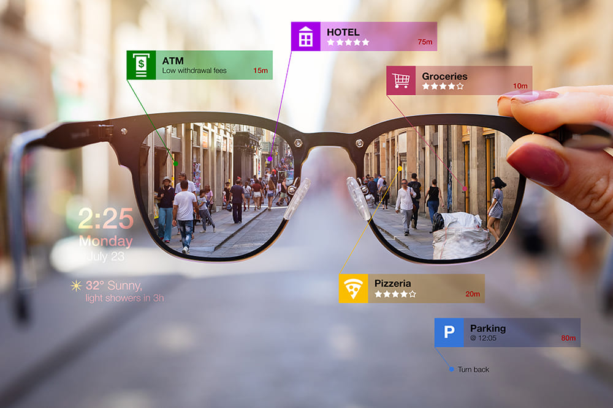

# Project ZERO — Wearable AR AI Assistant (Raspberry Pi 5)

> Voice-first, hand-tracked, passthrough AR on a Pi 5.  
> Wake word **“ZERO”** → talk to GPT/Grok → HUD replies in your glasses.  
> Gesture to move a cursor, click, scroll, and manipulate 3D/CAD models.



---

## ✨ Features

- **Hands-free control**: Hotword “ZERO”, offline STT optional, TTS responses.
- **Gesture navigation**: Index = cursor, pinch = click/drag, two-finger = scroll.
- **Passthrough HUD**: CSI camera feed + OpenCV overlays (low latency).
- **LLM integration**: GPT/Grok with local knowledge base for project rundowns.
- **AR models**: Load `.gltf`, explode CAD assemblies, anchor with ArUco/AprilTags.
- **OS control**: Virtual HID via `uinput`—open apps, type, shortcuts.

---

## 📦 Hardware (core build)

- Raspberry Pi 5 (8GB recommended)
- CSI camera (Camera Module 3 Wide)
- 1× micro HDMI micro-display (1.3–1.5") **or** AR glasses w/ HDMI-in
- I²S or USB mini mic, small speaker/bone-conduction (optional)
- 30,000 mAh USB-C PD pack (you have this)
- 3D-printed goggle frame + mounts

Full BOM with links: **[docs/hardware-bom.md](docs/hardware-bom.md)**

---

## 🧰 Software stack

- **OS**: Raspberry Pi OS Bookworm 64-bit (Wayland or X11)
- **Vision**: Picamera2 + OpenCV
- **Hands**: MediaPipe (or TF-Lite hand landmarks)
- **Input**: `python-evdev` + `uinput` (virtual mouse/keyboard)
- **Voice**: Porcupine/Vosk (hotword), Whisper (STT), Piper/ElevenLabs (TTS)
- **LLM**: OpenAI (GPT) or xAI (Grok) via `software/zero_core/llm.py`
- **AR**: OpenGL ES viewer for `.gltf` (+ ArUco anchoring)

---

## 🚀 Quick start

> Fresh Pi 5 on Bookworm (64-bit desktop):

```bash
sudo apt update && sudo apt full-upgrade -y
sudo apt install -y python3-pip python3-opencv python3-libcamera python3-picamera2 \
                    python3-numpy libatlas-base-dev python3-evdev python3-pyopengl \
                    libgles2-mesa-dev libgl1-mesa-dri
git clone https://github.com/<you>/project-zero.git
cd project-zero/software
pip3 install -r requirements.txt

# enable virtual HID
echo uinput | sudo tee -a /etc/modules
sudo modprobe uinput

# optional: give GPU more memory
echo "gpu_mem=512" | sudo tee -a /boot/firmware/config.txt
sudo reboot
